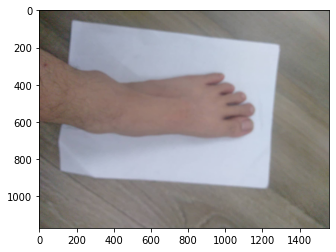
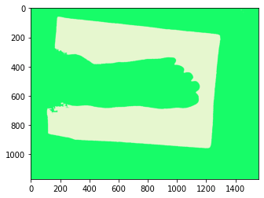
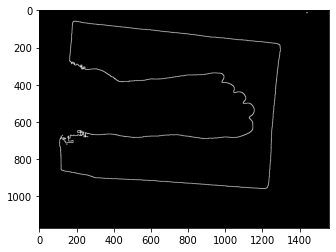
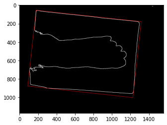
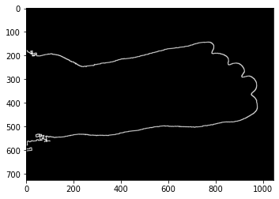
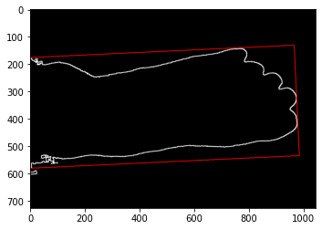

# Foot Measurement
## Web application
Visit https://share.streamlit.io/scinerd68/footdetection/main/foot_detection.py to see the result.
## Approach
- Use k-means to segment the image
- Detect edges on the segmented image
- Detect bouding box around the A4 paper
- Crop the A4 paper from the image
- Detect bounding box around the foot
- Based on length and width of paper's bounding box and foot's bouding box calculate real length and width of the foot (in cm) and output shoe size based on measured length and width
## Image requirements
The uploaded image must satisfy the following requirements
- Foot should be on an A4 paper, with the heel touching 1 edge of the paper
- Floor color should not be white
- Paper must be completly visible (all 4 corners are visible)
## Visualization
Original image:  

Step 1: Segment image  

Step 2: Detect edges  

Step 3: Detect paper bounding box  

Step 4: Crop paper  

Step 5: Detect foot bounding box  

